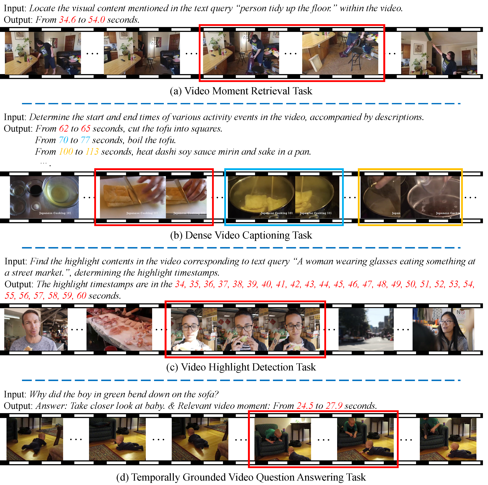

# Awesome-MLLMs-for-Video-Temporal-Grounding [](https://awesome.re)

<h3 align="center">
🔥 <a href="https://arxiv.org/abs/xxxx">A Survey on Video Temporal Grounding with Multimodal Large Language Model</a>
</h3>

<div align="center">
    <p>
    作者信息
    </p>
    <p>
    
    </p>
</div>

Video Temporal Grounding (VTG) focuses on locating and understanding temporal segments in untrimmed videos based on multimodal queries. Core tasks include **video moment retrieval**, **dense video captioning**, **video highlight detection**, and **temporally grounded video QA**, all requiring fine-grained temporal reasoning.

With the rise of Multimodal Large Language Models (MLLMs), VTG has seen transformative progress. These models bring powerful cross-modal alignment and semantic reasoning abilities, enabling flexible, generalizable solutions across VTG tasks.

This repository aims to serve as a curated reference point for researchers and practitioners interested in advancing the field of video temporal grounding through the lens of large multimodal models.


## News

## Table of Contents

- [Awesome-MLLMs-for-Video-Temporal-Grounding](#awesome-mllms-for-video-temporal-grounding-)
  - [1️⃣ 🧠 Functional Roles of MLLMs in VTG-MLLMs](#-functional-roles-of-mllms-in-vtg-mllms)
    - [Facilitator](#facilitator)
    - [Executor](#executor)
  - [2️⃣ 🛠️ Training Paradigms of VTG-MLLMs](#%EF%B8%8F-training-paradigms-of-vtg-mllms)
    - [Pretraining](#pretraining)
    - [Fine-Tuning](#fine-tuning)
    - [Training-Free](#training-free)
  - [3️⃣ 🎞️ Video Feature Processing in VTG-MLLMs](#%EF%B8%8F-video-feature-processing-in-vtg-mllms)
    - [Visual Feature](#visual-feature)
      - [Compression](#Compression)
      - [Refinement](#Refinement)
    - [Temporal Feature](#temporal-feature)
      - [Explicit](#Explicit)
      - [Implicit](#Implicit)
  - [4️⃣ 📬 Contact](#contact)

---

## 🧠 Functional Roles of MLLMs in VTG-MLLMs

### Facilitator
MLLMs generate structured textual representations from video content to support downstream modules.
| Title                                                        |       Model        |  Date   |                         Link                         |      Venue       |
| :----------------------------------------------------------- | :----------------: | :-----: | :--------------------------------------------------: | :--------------: |
| [**Grounding-Prompter: Prompting LLM with Multimodal Information for Temporal Sentence Grounding in Long Videos**](http://arxiv.org/abs/2312.17117) | Grounding-Prompter | 12/2023 |                          -                           |      arXiv       |
| [**VTG-GPT: Tuning-Free Zero-Shot Video Temporal Grounding with GPT**](https://arxiv.org/abs/2403.02076) |      VTG-GPT       | 03/2024 |   [project](https://github.com/YoucanBaby/VTG-GPT)   | Applied Sciences |
| [**GPTSee: Enhancing Moment Retrieval and Highlight Detection via Description-Based Similarity Features**](http://arxiv.org/abs/2403.01437) |       GPTSee       | 03/2024 |                          -                           |     IEEE SPL     |
| [**Grounded Question-Answering in Long Egocentric Videos**](https://arxiv.org/abs/2312.06505) |     GroundVQA      | 04/2024 | [project](https://github.com/Becomebright/GroundVQA) |       CVPR       |
| [**Context-Enhanced Video Moment Retrieval with Large Language Models**](http://arxiv.org/abs/2405.12540) |        LMR         | 05/2024 |                          -                           |      arXiv       |
| [**MLLM as Video Narrator: Mitigating Modality Imbalance in Video Moment Retrieval**](http://arxiv.org/abs/2406.17880) |        TEA         | 06/2024 |                          -                           |      arXiv       |
| [**Training-free Video Temporal Grounding using Large-scale Pre-trained Models**](http://arxiv.org/abs/2408.16219) |       TFVTG        | 08/2024 |    [project](https://github.com/minghangz/TFVTG)     |       ECCV       |
| [**Infusing Environmental Captions for Long-Form Video Language Grounding**](http://arxiv.org/abs/2408.02336) |       EI-VLG       | 08/2024 |                          -                           |      arXiv       |
| [**Question-Answering Dense Video Events**](http://arxiv.org/abs/2409.04388) |        DeVi        | 09/2024 |     [project](https://github.com/QHUni/DeVE-QA)      |      SIGIR       |
| [**ChatVTG: Video Temporal Grounding via Chat with Video Dialogue Large Language Models**](http://arxiv.org/abs/2410.12813) |      ChatVTG       | 10/2024 |                          -                           |       CVPR       |
| [**TimeCraft: Navigate Weakly-Supervised Temporal Grounded Video Question Answering via Bi-directional Reasoning**](https://www.ecva.net/papers/eccv_2024/papers_ECCV/papers/00720.pdf) |     TimeCraft      | 10/2024 |                          -                           |       ECCV       |
| [**VERIFIED: A Video Corpus Moment Retrieval Benchmark for Fine-Grained Video Understanding**](http://arxiv.org/abs/2410.08593) |      VERIFIED      | 10/2024 |   [project](https://github.com/hlchen23/VERIFIED)    |      arXiv       |
| [**VideoLights: Feature Refinement and Cross-Task Alignment Transformer for Joint Video Highlight Detection and Moment Retrieval**](http://arxiv.org/abs/2412.01558) |    VideoLights     | 12/2024 |  [project](https://github.com/dpaul06/VideoLights)   |      arXiv       |
| [**Vid-Morp: Video Moment Retrieval Pretraining from Unlabeled Videos in the Wild**](http://arxiv.org/abs/2412.00811) |     ReCorrect      | 12/2024 |     [project](https://github.com/baopj/Vid-Morp)     |      arXiv       |
| [**Zero-shot Video Moment Retrieval via Off-the-shelf Multimodal Large Language Models**](http://arxiv.org/abs/2501.07972) |     Moment-GPT     | 01/2025 |                          -                           |       AAAI       |


### Executor
MLLMs directly perform temporal boundary prediction via integrated multimodal reasoning.
| Title                                                        |       Model       |  Date   |                             Link                             |  Venue   |
| :----------------------------------------------------------- | :---------------: | :-----: | :----------------------------------------------------------: | :------: |
| [**Self-Chained Image-Language Model for Video Localization and Question Answering**](http://arxiv.org/abs/2305.06988) |      SeViLA       | 05/2023 |        [project](https://github.com/Yui010206/SeViLA)        | NeurIPS  |
| [**LLaViLo: Boosting Video Moment Retrieval via Adapter-Based Multimodal Modeling**](https://ieeexplore.ieee.org/document/10350951/) |      LLaViLo      | 10/2023 |                              -                               |   ICCV   |
| [**VTimeLLM: Empower LLM to Grasp Video Moments**](http://arxiv.org/abs/2311.18445) |     VTimeLLM      | 11/2023 |       [project](https://github.com/huangb23/VTimeLLM)        |   CVPR   |
| [**TimeChat: A Time-sensitive Multimodal Large Language Model for Long Video Understanding**](http://arxiv.org/abs/2312.02051) |     TimeChat      | 12/2023 |    [project](https://github.com/RenShuhuai-Andy/TimeChat)    |   CVPR   |
| [**GroundingGPT:Language Enhanced Multi-modal Grounding Model**](http://arxiv.org/abs/2401.06071) |   GroundingGPT    | 03/2024 | [project](https://lzw-lzw.github.io/GroundingGPT.github.io/) |   ACL    |
| [**HawkEye: Training Video-Text LLMs for Grounding Text in Videos**](http://arxiv.org/abs/2403.10228) |      HawkEye      | 03/2024 |   [project](https://github.com/yellow-binary-tree/HawkEye)   |  arXiv   |
| [**LITA: Language Instructed Temporal-Localization Assistant**](http://arxiv.org/abs/2403.19046) |       LITA        | 03/2024 |          [project](https://github.com/NVlabs/LITA)           |   ECCV   |
| [**VTG-LLM: Integrating Timestamp Knowledge into Video LLMs for Enhanced Video Temporal Grounding**](http://arxiv.org/abs/2405.13382) |      VTG-LLM      | 05/2024 |         [project](https://github.com/gyxxyg/VTG-LLM)         |   AAAI   |
| [**The Surprising Effectiveness of Multimodal Large Language Models for Video Moment Retrieval**](http://arxiv.org/abs/2406.18113) |      Mr.BLIP      | 06/2024 |       [project](https://github.com/sudo-Boris/mr-Blip)       |  arXiv   |
| [**Momentor: Advancing Video Large Language Model with Fine-Grained Temporal Reasoning**](http://arxiv.org/abs/2402.11435) |     Momentor      | 06/2024 |        [project](https://github.com/DCDmllm/Momentor)        |   ICML   |
| [**Grounded Multi-Hop VideoQA in Long-Form Egocentric Videos**](http://arxiv.org/abs/2408.14469) |       GeLM        | 08/2024 |    [project](https://qirui-chen.github.io/MultiHop-EgoQA)    |   AAAI   |
| [**SlowFocus: Enhancing Fine-grained Temporal Understanding in Video LLM**](https://openreview.net/forum?id=FOkKndty5B) |     SlowFocus     | 09/2024 |      [project](https://github.com/fudan-zvg/SlowFocus)       | NeurIPS  |
| [**E.T. Bench: Towards Open-Ended Event-Level Video-Language Understanding**](http://arxiv.org/abs/2409.18111) |     E.T.Chat      | 09/2024 |     [project](https://polyu-chenlab.github.io/etbench/)      | NeurIPS  |
| [**Grounded-VideoLLM: Sharpening Fine-grained Temporal Grounding in Video Large Language Models**](http://arxiv.org/abs/2410.03290) | Grounded-VideoLLM | 10/2024 |  [project](https://github.com/WHB139426/Grounded-Video-LLM)  |  arXiv   |
| [**Efficient Temporal Extrapolation of Multimodal Large Language Models with Temporal Grounding Bridge**](https://arxiv.org/abs/2402.16050) |        TGB        | 10/2024 |      [project](https://github.com/bigai-nlco/VideoTGB)       |  EMNLP   |
| [**TimeSuite: Improving MLLMs for Long Video Understanding via Grounded Tuning**](http://arxiv.org/abs/2410.19702) |     TimeSuite     | 10/2024 |      [project](https://github.com/OpenGVLab/TimeSuite)       |   ICLR   |
| [**TRACE: Temporal Grounding Video LLM via Causal Event Modeling**](http://arxiv.org/abs/2410.05643) |       TRACE       | 11/2024 |          [project](https://github.com/gyxxyg/TRACE)          |   ICLR   |
| [**ReVisionLLM: Recursive Vision-Language Model for Temporal Grounding in Hour-Long Videos**](http://arxiv.org/abs/2411.14901) |    ReVisionLLM    | 11/2024 |     [project](https://github.com/Tanveer81/ReVisionLLM)      |  CVPR   |
| [**Number it: Temporal Grounding Videos like Flipping Manga**](http://arxiv.org/abs/2411.10332) |      NumPro       | 11/2024 |      [project](https://github.com/yongliang-wu/NumPro)       |   CVPR   |
| [**LLaVA-MR: Large Language-and-Vision Assistant for Video Moment Retrieval**](http://arxiv.org/abs/2411.14505) |     LLaVA-MR      | 11/2024 |                              -                               |  arXiv   |
| [**TimeMarker: A Versatile Video-LLM for Long and Short Video Understanding with Superior Temporal Localization Ability**](http://arxiv.org/abs/2411.18211) |    TimeMarker     | 11/2024 |   [project](https://github.com/TimeMarker-LLM/TimeMarker/)   |  arXiv   |
| [**Seq2Time: Sequential Knowledge Transfer for Video LLM Temporal Grounding**](http://arxiv.org/abs/2411.16932) |     Seq2Time      | 11/2024 |                              -                               |  arXiv   |
| [**Task Preference Optimization: Improving Multimodal Large Language Models with Vision Task Alignment**](http://arxiv.org/abs/2412.19326) |   VideoChat-TPO   | 12/2024 |         [project](https://github.com/OpenGVLab/TPO)          |  arXiv   |
| [**MLLM-TA: Leveraging Multimodal Large Language Models for Precise Temporal Video Grounding**](https://ieeexplore.ieee.org/document/10777595/) |      MLLM-TA      | 12/2024 |                              -                               | IEEE SPL |
| [**Video LLMs for Temporal Reasoning in Long Videos**](http://arxiv.org/abs/2412.02930) |    TemporalVLM    | 12/2024 | [project](https://retrocausal.ai/wp-content/TemporalVLM.html) |  arXiv   |
| [**TimeRefine: Temporal Grounding with Time Refining Video LLM**](http://arxiv.org/abs/2412.09601) |    TimeRefine     | 12/2024 |       [project](https://github.com/SJTUwxz/TimeRefine)       |  arXiv   |
| [**LLaVA-ST: A Multimodal Large Language Model for Fine-Grained Spatial-Temporal Understanding**](http://arxiv.org/abs/2501.08282) |     LLaVA-ST      | 01/2025 |      [project](https://github.com/appletea233/LLaVA-ST)      |  arXiv   |
| [**Mitigating the Discrepancy Between Video and Text Temporal Sequences: A Time-Perception Enhanced Video Grounding method for LLM**](https://aclanthology.org/2025.coling-main.655/) |     TPE-VLLM      | 01/2025 |      [project](https://github.com/lixuefenfen/TPE-VLLM)      |  COLING  |
| [**Measure Twice, Cut Once: Grasping Video Structures and Event Semantics with LLMs for Video Temporal Localization**](http://arxiv.org/abs/2503.09027) |       MeCo        | 03/2025 |          [project](https://github.com/pangzss/MeCo)          |  arXiv   |
| [**VideoMind: A Chain-of-LoRA Agent for Long Video Reasoning**](http://arxiv.org/abs/2503.13444) |     VideoMind     | 04/2025 |           [project](https://videomind.github.io/)            |  arXiv   |
| [**VideoExpert: Augmented LLM for Temporal-Sensitive Video Understanding**](http://arxiv.org/abs/2504.07519) |    VideoExpert    | 04/2025 |                              -                               |  arXiv   |
| [**VideoChat-R1: Enhancing Spatio-Temporal Perception via Reinforcement Fine-Tuning**](http://arxiv.org/abs/2504.06958) |   VideoChat-R1    | 04/2025 |     [project](https://github.com/OpenGVLab/VideoChat-R1)     |  arXiv   |
| [**SpaceVLLM: Endowing Multimodal Large Language Model with Spatio-Temporal Video Grounding Capability**](http://arxiv.org/abs/2503.13983) |     SpaceVLLM     | 04/2025 |       [project](https://github.com/Jayce1kk/SpaceVLLM)       |  arXiv   |
| [**Time-R1: Post-Training Large Vision Language Model for Temporal Video Grounding**](http://arxiv.org/abs/2503.13377) |      Time-R1      | 05/2025 |        [project](https://xuboshen.github.io/Time-R1/)        |  arXiv   |
| [**MUSEG: Reinforcing Video Temporal Understanding via Timestamp-Aware Multi-Segment Grounding**](http://arxiv.org/abs/2505.20715) |       MUSEG       | 05/2025 |        [project](https://github.com/THUNLP-MT/MUSEG)         |  arXiv   |

---

## 🛠️ Training Paradigms of VTG-MLLMs

### Pretraining  
Pretraining in VTG-MLLMs aims to establish strong temporal reasoning capabilities through large-scale supervised learning.
| Title                                                        |       Model       |  Date   |                             Link                             |  Venue   |
| :----------------------------------------------------------- | :---------------: | :-----: | :----------------------------------------------------------: | :------: |
| [**Self-Chained Image-Language Model for Video Localization and Question Answering**](http://arxiv.org/abs/2305.06988) |      SeViLA       | 05/2023 |        [project](https://github.com/Yui010206/SeViLA)        | NeurIPS  |
| [**VTimeLLM: Empower LLM to Grasp Video Moments**](http://arxiv.org/abs/2311.18445) |     VTimeLLM      | 11/2023 |       [project](https://github.com/huangb23/VTimeLLM)        |   CVPR   |
| [**TimeChat: A Time-sensitive Multimodal Large Language Model for Long Video Understanding**](http://arxiv.org/abs/2312.02051) |     TimeChat      | 12/2023 |    [project](https://github.com/RenShuhuai-Andy/TimeChat)    |   CVPR   |
| [**GroundingGPT:Language Enhanced Multi-modal Grounding Model**](http://arxiv.org/abs/2401.06071) |   GroundingGPT    | 03/2024 | [project](https://lzw-lzw.github.io/GroundingGPT.github.io/) |   ACL    |
| [**HawkEye: Training Video-Text LLMs for Grounding Text in Videos**](http://arxiv.org/abs/2403.10228) |      HawkEye      | 03/2024 |   [project](https://github.com/yellow-binary-tree/HawkEye)   |  arXiv   |
| [**LITA: Language Instructed Temporal-Localization Assistant**](http://arxiv.org/abs/2403.19046) |       LITA        | 03/2024 |          [project](https://github.com/NVlabs/LITA)           |   ECCV   |
| [**VTG-LLM: Integrating Timestamp Knowledge into Video LLMs for Enhanced Video Temporal Grounding**](http://arxiv.org/abs/2405.13382) |      VTG-LLM      | 05/2024 |         [project](https://github.com/gyxxyg/VTG-LLM)         |   AAAI   |
| [**Momentor: Advancing Video Large Language Model with Fine-Grained Temporal Reasoning**](http://arxiv.org/abs/2402.11435) |     Momentor      | 06/2024 |        [project](https://github.com/DCDmllm/Momentor)        |   ICML   |
| [**Grounded Multi-Hop VideoQA in Long-Form Egocentric Videos**](http://arxiv.org/abs/2408.14469) |       GeLM        | 08/2024 |    [project](https://qirui-chen.github.io/MultiHop-EgoQA)    |   AAAI   |
| [**SlowFocus: Enhancing Fine-grained Temporal Understanding in Video LLM**](https://openreview.net/forum?id=FOkKndty5B) |     SlowFocus     | 09/2024 |      [project](https://github.com/fudan-zvg/SlowFocus)       | NeurIPS  |
| [**E.T. Bench: Towards Open-Ended Event-Level Video-Language Understanding**](http://arxiv.org/abs/2409.18111) |     E.T.Chat      | 09/2024 |     [project](https://polyu-chenlab.github.io/etbench/)      | NeurIPS  |
| [**Grounded-VideoLLM: Sharpening Fine-grained Temporal Grounding in Video Large Language Models**](http://arxiv.org/abs/2410.03290) | Grounded-VideoLLM | 10/2024 |  [project](https://github.com/WHB139426/Grounded-Video-LLM)  |  arXiv   |
| [**TimeSuite: Improving MLLMs for Long Video Understanding via Grounded Tuning**](http://arxiv.org/abs/2410.19702) |     TimeSuite     | 10/2024 |      [project](https://github.com/OpenGVLab/TimeSuite)       |   ICLR   |
| [**TRACE: Temporal Grounding Video LLM via Causal Event Modeling**](http://arxiv.org/abs/2410.05643) |       TRACE       | 11/2024 |          [project](https://github.com/gyxxyg/TRACE)          |   ICLR   |
| [**ReVisionLLM: Recursive Vision-Language Model for Temporal Grounding in Hour-Long Videos**](http://arxiv.org/abs/2411.14901) |    ReVisionLLM    | 11/2024 |     [project](https://github.com/Tanveer81/ReVisionLLM)      |   CVPR   |
| [**TimeMarker: A Versatile Video-LLM for Long and Short Video Understanding with Superior Temporal Localization Ability**](http://arxiv.org/abs/2411.18211) |    TimeMarker     | 11/2024 |   [project](https://github.com/TimeMarker-LLM/TimeMarker/)   |  arXiv   |
| [**Task Preference Optimization: Improving Multimodal Large Language Models with Vision Task Alignment**](http://arxiv.org/abs/2412.19326) |   VideoChat-TPO   | 12/2024 |         [project](https://github.com/OpenGVLab/TPO)          |  arXiv   |
| [**MLLM-TA: Leveraging Multimodal Large Language Models for Precise Temporal Video Grounding**](https://ieeexplore.ieee.org/document/10777595/) |      MLLM-TA      | 12/2024 |                              -                               | IEEE SPL |
| [**Video LLMs for Temporal Reasoning in Long Videos**](http://arxiv.org/abs/2412.02930) |    TemporalVLM    | 12/2024 | [project](https://retrocausal.ai/wp-content/TemporalVLM.html) |  arXiv   |
| [**TimeRefine: Temporal Grounding with Time Refining Video LLM**](http://arxiv.org/abs/2412.09601) |    TimeRefine     | 12/2024 |       [project](https://github.com/SJTUwxz/TimeRefine)       |  arXiv   |
| [**LLaVA-ST: A Multimodal Large Language Model for Fine-Grained Spatial-Temporal Understanding**](http://arxiv.org/abs/2501.08282) |     LLaVA-ST      | 01/2025 |      [project](https://github.com/appletea233/LLaVA-ST)      |  arXiv   |
| [**Mitigating the Discrepancy Between Video and Text Temporal Sequences: A Time-Perception Enhanced Video Grounding method for LLM**](https://aclanthology.org/2025.coling-main.655/) |     TPE-VLLM      | 01/2025 |      [project](https://github.com/lixuefenfen/TPE-VLLM)      |  COLING  |
| [**Measure Twice, Cut Once: Grasping Video Structures and Event Semantics with LLMs for Video Temporal Localization**](http://arxiv.org/abs/2503.09027) |       MeCo        | 03/2025 |          [project](https://github.com/pangzss/MeCo)          |  arXiv   |
| [**VideoMind: A Chain-of-LoRA Agent for Long Video Reasoning**](http://arxiv.org/abs/2503.13444) |     VideoMind     | 04/2025 |           [project](https://videomind.github.io/)            |  arXiv   |
| [**VideoExpert: Augmented LLM for Temporal-Sensitive Video Understanding**](http://arxiv.org/abs/2504.07519) |    VideoExpert    | 04/2025 |                              -                               |  arXiv   |
| [**VideoChat-R1: Enhancing Spatio-Temporal Perception via Reinforcement Fine-Tuning**](http://arxiv.org/abs/2504.06958) |   VideoChat-R1    | 04/2025 |     [project](https://github.com/OpenGVLab/VideoChat-R1)     |  arXiv   |
| [**SpaceVLLM: Endowing Multimodal Large Language Model with Spatio-Temporal Video Grounding Capability**](http://arxiv.org/abs/2503.13983) |     SpaceVLLM     | 04/2025 |       [project](https://github.com/Jayce1kk/SpaceVLLM)       |  arXiv   |
| [**Time-R1: Post-Training Large Vision Language Model for Temporal Video Grounding**](http://arxiv.org/abs/2503.13377) |      Time-R1      | 05/2025 |        [project](https://xuboshen.github.io/Time-R1/)        |  arXiv   |
| [**MUSEG: Reinforcing Video Temporal Understanding via Timestamp-Aware Multi-Segment Grounding**](http://arxiv.org/abs/2505.20715) |       MUSEG       | 05/2025 |        [project](https://github.com/THUNLP-MT/MUSEG)         |  arXiv   |

### Fine-Tuning  
Adapts general-purpose MLLMs to downstream VTG tasks through supervised fine-tuning on temporally annotated training datasets.
| Title                                                        |  Model   |  Date   |                       Link                        |  Venue   |
| :----------------------------------------------------------- | :------: | :-----: | :-----------------------------------------------: | :------: |
| [**LLaViLo: Boosting Video Moment Retrieval via Adapter-Based Multimodal Modeling**](https://ieeexplore.ieee.org/document/10350951/) | LLaViLo  | 10/2023 |                         -                         |   ICCV   |
| [**GPTSee: Enhancing Moment Retrieval and Highlight Detection via Description-Based Similarity Features**](http://arxiv.org/abs/2403.01437) |  GPTSee  | 03/2024 |                         -                         | IEEE SPL |
| [**Context-Enhanced Video Moment Retrieval with Large Language Models**](http://arxiv.org/abs/2405.12540) |   LMR    | 05/2024 |                         -                         |  arXiv   |
| [**The Surprising Effectiveness of Multimodal Large Language Models for Video Moment Retrieval**](http://arxiv.org/abs/2406.18113) | Mr.BLIP  | 06/2024 | [project](https://github.com/sudo-Boris/mr-Blip)  |  arXiv   |
| [**MLLM as Video Narrator: Mitigating Modality Imbalance in Video Moment Retrieval**](http://arxiv.org/abs/2406.17880) |   TEA    | 06/2024 |                         -                         |  arXiv   |
| [**Infusing Environmental Captions for Long-Form Video Language Grounding**](http://arxiv.org/abs/2408.02336) |  EI-VLG  | 08/2024 |                         -                         |  arXiv   |
| [**Efficient Temporal Extrapolation of Multimodal Large Language Models with Temporal Grounding Bridge**](https://arxiv.org/abs/2402.16050) |   TGB    | 10/2024 | [project](https://github.com/bigai-nlco/VideoTGB) |  EMNLP   |
| [**LLaVA-MR: Large Language-and-Vision Assistant for Video Moment Retrieval**](http://arxiv.org/abs/2411.14505) | LLaVA-MR | 11/2024 |                         -                         |  arXiv   |
| [**Vid-Morp: Video Moment Retrieval Pretraining from Unlabeled Videos in the Wild**](http://arxiv.org/abs/2412.00811) |     ReCorrect     | 12/2024 |         [project](https://github.com/baopj/Vid-Morp)         |  arXiv   |
| [**VideoLights: Feature Refinement and Cross-Task Alignment Transformer for Joint Video Highlight Detection and Moment Retrieval**](http://arxiv.org/abs/2412.01558) |    VideoLights     | 12/2024 |  [project](https://github.com/dpaul06/VideoLights)   |      arXiv       |

### Training-Free  
Training-free approaches integrate pre-trained foundation models with specialized expert tools through the carefully designed pipeline architecture.
| Title                                                        |       Model        |  Date   |                       Link                        |      Venue       |
| :----------------------------------------------------------- | :----------------: | :-----: | :-----------------------------------------------: | :--------------: |
| [**Grounding-Prompter: Prompting LLM with Multimodal Information for Temporal Sentence Grounding in Long Videos**](http://arxiv.org/abs/2312.17117) | Grounding-Prompter | 12/2023 |                         -                         |      arXiv       |
| [**VTG-GPT: Tuning-Free Zero-Shot Video Temporal Grounding with GPT**](https://arxiv.org/abs/2403.02076) |      VTG-GPT       | 03/2024 | [project](https://github.com/YoucanBaby/VTG-GPT)  | Applied Sciences |
| [**Training-free Video Temporal Grounding using Large-scale Pre-trained Models**](http://arxiv.org/abs/2408.16219) |       TFVTG        | 08/2024 |   [project](https://github.com/minghangz/TFVTG)   |       ECCV       |
| [**Question-Answering Dense Video Events**](http://arxiv.org/abs/2409.04388) |        DeVi        | 09/2024 |    [project](https://github.com/QHUni/DeVE-QA)    |      SIGIR       |
| [**ChatVTG: Video Temporal Grounding via Chat with Video Dialogue Large Language Models**](http://arxiv.org/abs/2410.12813) |      ChatVTG       | 10/2024 |                         -                         |       CVPR       |
| [**Number it: Temporal Grounding Videos like Flipping Manga**](http://arxiv.org/abs/2411.10332) |       NumPro       | 11/2024 | [project](https://github.com/yongliang-wu/NumPro) |       CVPR       |
| [**Zero-shot Video Moment Retrieval via Off-the-shelf Multimodal Large Language Models**](http://arxiv.org/abs/2501.07972) |     Moment-GPT     | 01/2025 |                         -                         |       AAAI       |

---

## 🎞️ Video Feature Processing in VTG-MLLMs

### Visual Feature

Efficient visual feature handling is essential for capturing more fine-grained temporal cues without overwhelming the model.

#### Compression  
Directly compress visual features from densely sampled frames within budget constraints.
| Title                                                        |       Model       |  Date   |                            Link                            |  Venue  |
| :----------------------------------------------------------- | :---------------: | :-----: | :--------------------------------------------------------: | :-----: |
| [**LITA: Language Instructed Temporal-Localization Assistant**](http://arxiv.org/abs/2403.19046) |       LITA        | 03/2024 |         [project](https://github.com/NVlabs/LITA)          |  ECCV   |
| [**VTG-LLM: Integrating Timestamp Knowledge into Video LLMs for Enhanced Video Temporal Grounding**](http://arxiv.org/abs/2405.13382) |      VTG-LLM      | 05/2024 |        [project](https://github.com/gyxxyg/VTG-LLM)        |  AAAI   |
| [**E.T. Bench: Towards Open-Ended Event-Level Video-Language Understanding**](http://arxiv.org/abs/2409.18111) |     E.T.Chat      | 09/2024 |    [project](https://polyu-chenlab.github.io/etbench/)     | NeurIPS |
| [**Grounded-VideoLLM: Sharpening Fine-grained Temporal Grounding in Video Large Language Models**](http://arxiv.org/abs/2410.03290) | Grounded-VideoLLM | 10/2024 | [project](https://github.com/WHB139426/Grounded-Video-LLM) |  arXiv  |
| [**TimeSuite: Improving MLLMs for Long Video Understanding via Grounded Tuning**](http://arxiv.org/abs/2410.19702) |     TimeSuite     | 10/2024 |     [project](https://github.com/OpenGVLab/TimeSuite)      |  ICLR   |
| [**TRACE: Temporal Grounding Video LLM via Causal Event Modeling**](http://arxiv.org/abs/2410.05643) |       TRACE       | 11/2024 |         [project](https://github.com/gyxxyg/TRACE)         |  ICLR   |
| [**ReVisionLLM: Recursive Vision-Language Model for Temporal Grounding in Hour-Long Videos**](http://arxiv.org/abs/2411.14901) |    ReVisionLLM    | 11/2024 |    [project](https://github.com/Tanveer81/ReVisionLLM)     |  CVPR   |
| [**LLaVA-MR: Large Language-and-Vision Assistant for Video Moment Retrieval**](http://arxiv.org/abs/2411.14505) |     LLaVA-MR      | 11/2024 |                             -                              |  arXiv  |
| [**TimeMarker: A Versatile Video-LLM for Long and Short Video Understanding with Superior Temporal Localization Ability**](http://arxiv.org/abs/2411.18211) |    TimeMarker     | 11/2024 |  [project](https://github.com/TimeMarker-LLM/TimeMarker/)  |  arXiv  |
| [**LLaVA-ST: A Multimodal Large Language Model for Fine-Grained Spatial-Temporal Understanding**](http://arxiv.org/abs/2501.08282) |     LLaVA-ST      | 01/2025 |     [project](https://github.com/appletea233/LLaVA-ST)     |  arXiv  |
| [**VideoExpert: Augmented LLM for Temporal-Sensitive Video Understanding**](http://arxiv.org/abs/2504.07519) |    VideoExpert    | 04/2025 |                             -                              |  arXiv  |

#### Refinement  
Gradually refine predictions to maintain performance with the input token limitations.
| Title                                                        |    Model    |  Date   |                           Link                           |  Venue  |
| :----------------------------------------------------------- | :---------: | :-----: | :------------------------------------------------------: | :-----: |
| [**Self-Chained Image-Language Model for Video Localization and Question Answering**](http://arxiv.org/abs/2305.06988) |   SeViLA    | 05/2023 |      [project](https://github.com/Yui010206/SeViLA)      | NeurIPS |
| [**HawkEye: Training Video-Text LLMs for Grounding Text in Videos**](http://arxiv.org/abs/2403.10228) |   HawkEye   | 03/2024 | [project](https://github.com/yellow-binary-tree/HawkEye) |  arXiv  |
| [**SlowFocus: Enhancing Fine-grained Temporal Understanding in Video LLM**](https://openreview.net/forum?id=FOkKndty5B) |  SlowFocus  | 09/2024 |    [project](https://github.com/fudan-zvg/SlowFocus)     | NeurIPS |
| [**ReVisionLLM: Recursive Vision-Language Model for Temporal Grounding in Hour-Long Videos**](http://arxiv.org/abs/2411.14901) | ReVisionLLM | 11/2024 |   [project](https://github.com/Tanveer81/ReVisionLLM)    |  CVPR   |
| [**VideoMind: A Chain-of-LoRA Agent for Long Video Reasoning**](http://arxiv.org/abs/2503.13444) |  VideoMind  | 04/2025 |         [project](https://videomind.github.io/)          |  arXiv  |

### Temporal Feature

Precise temporal feature representation and modeling is crucial for aligning visual content with fine-grained timestamp intervals, enabling accurate temporal reasoning in VTG tasks.

#### Explicit  
Explicit modeling strategies directly furnish MLLMs with unambiguous temporal information, offering direct control and interpretability over temporal cues.
| Title                                                        |    Model    |  Date   |                           Link                           |  Venue  |
| :----------------------------------------------------------- | :---------: | :-----: | :------------------------------------------------------: | :-----: |
| [**LITA: Language Instructed Temporal-Localization Assistant**](http://arxiv.org/abs/2403.19046) |    LITA     | 03/2024 |        [project](https://github.com/NVlabs/LITA)         |  ECCV   |
| [**VTG-LLM: Integrating Timestamp Knowledge into Video LLMs for Enhanced Video Temporal Grounding**](http://arxiv.org/abs/2405.13382) |   VTG-LLM   | 05/2024 |       [project](https://github.com/gyxxyg/VTG-LLM)       |  AAAI   |
| [**The Surprising Effectiveness of Multimodal Large Language Models for Video Moment Retrieval**](http://arxiv.org/abs/2406.18113) |   Mr.BLIP   | 06/2024 |     [project](https://github.com/sudo-Boris/mr-Blip)     |  arXiv  |
| [**Momentor: Advancing Video Large Language Model with Fine-Grained Temporal Reasoning**](http://arxiv.org/abs/2402.11435) |  Momentor   | 06/2024 |      [project](https://github.com/DCDmllm/Momentor)      |  ICML   |
| [**SlowFocus: Enhancing Fine-grained Temporal Understanding in Video LLM**](https://openreview.net/forum?id=FOkKndty5B) |  SlowFocus  | 09/2024 |    [project](https://github.com/fudan-zvg/SlowFocus)     | NeurIPS |
| [**Efficient Temporal Extrapolation of Multimodal Large Language Models with Temporal Grounding Bridge**](https://arxiv.org/abs/2402.16050) |     TGB     | 10/2024 |    [project](https://github.com/bigai-nlco/VideoTGB)     |  EMNLP  |
| [**TRACE: Temporal Grounding Video LLM via Causal Event Modeling**](http://arxiv.org/abs/2410.05643) |    TRACE    | 11/2024 |     [project](httpshttps://github.com/gyxxyg/TRACE)      |  ICLR   |
| [**LLaVA-MR: Large Language-and-Vision Assistant for Video Moment Retrieval**](http://arxiv.org/abs/2411.14505) |  LLaVA-MR   | 11/2024 |                            -                             |  arXiv  |
| [**TimeMarker: A Versatile Video-LLM for Long and Short Video Understanding with Superior Temporal Localization Ability**](http://arxiv.org/abs/2411.18211) | TimeMarker  | 11/2024 | [project](https://github.com/TimeMarker-LLM/TimeMarker/) |  arXiv  |
| [**LLaVA-ST: A Multimodal Large Language Model for Fine-Grained Spatial-Temporal Understanding**](http://arxiv.org/abs/2501.08282) |  LLaVA-ST   | 01/2025 |    [project](https://github.com/appletea233/LLaVA-ST)    |  arXiv  |
| [**VideoExpert: Augmented LLM for Temporal-Sensitive Video Understanding**](http://arxiv.org/abs/2504.07519) | VideoExpert | 04/2025 |                            -                             |  arXiv  |

#### Implicit  
Implicit modeling strategies are divided into two main types: *Feature Infusion*, which subtly integrates temporal context during feature extraction, and *Intrinsic Reasoning*, which leverages the inherent sequential processing of LLMs.  By default, methods under this category are considered part of Intrinsic Reasoning, unless they explicitly incorporate external temporal features during encoding—in which case they are classified as Feature Infusion. The table below highlights representative works employing the Feature Infusion approach.
| Title                                                        |    Model    |  Date   |                          Link                          | Venue |
| :----------------------------------------------------------- | :---------: | :-----: | :----------------------------------------------------: | :---: |
| [**TimeChat: A Time-sensitive Multimodal Large Language Model for Long Video Understanding**](http://arxiv.org/abs/2312.02051) |  TimeChat   | 12/2023 | [project](https://github.com/RenShuhuai-Andy/TimeChat) | CVPR  |
| [**TimeSuite: Improving MLLMs for Long Video Understanding via Grounded Tuning**](http://arxiv.org/abs/2410.19702) |  TimeSuite  | 10/2024 |   [project](https://github.com/OpenGVLab/TimeSuite)    | ICLR  |
| [**Video LLMs for Temporal Reasoning in Long Videos**](http://arxiv.org/abs/2412.02930) | TemporalVLM | 12/2024 |                           [project](https://retrocausal.ai/wp-content/TemporalVLM.html)                            | arXiv |

---

## Contact
If you find our survey is useful in your research, please consider giving us a star 🌟 and cite the following paper:

```bibtex
@article{
}
```

If you have any question about this project, do not hesitate to contact me liuwei030224@gmail.com.